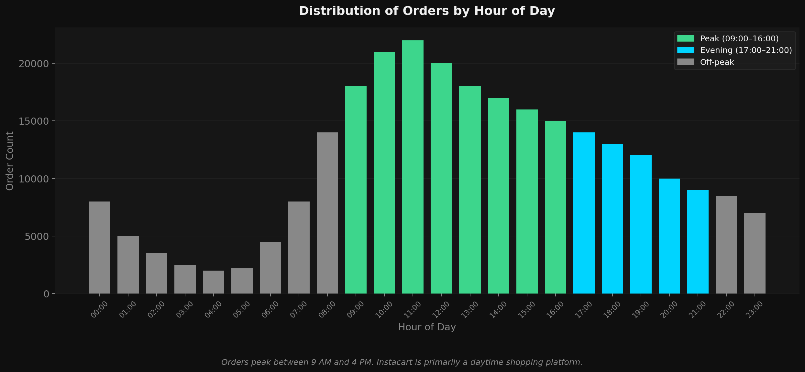
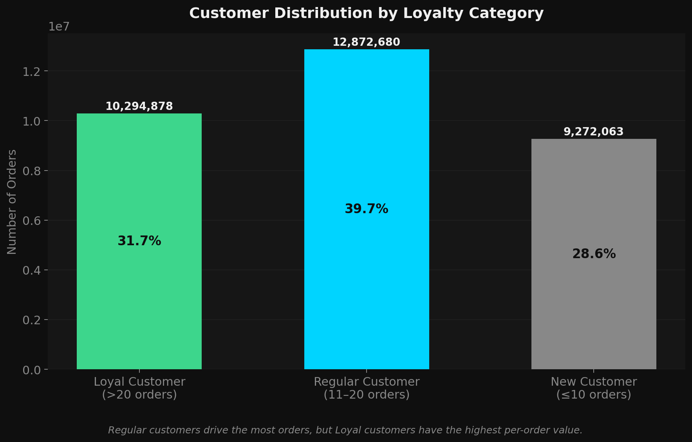
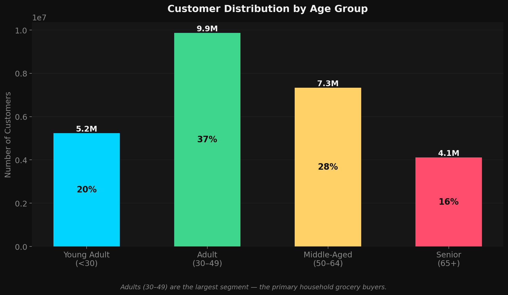
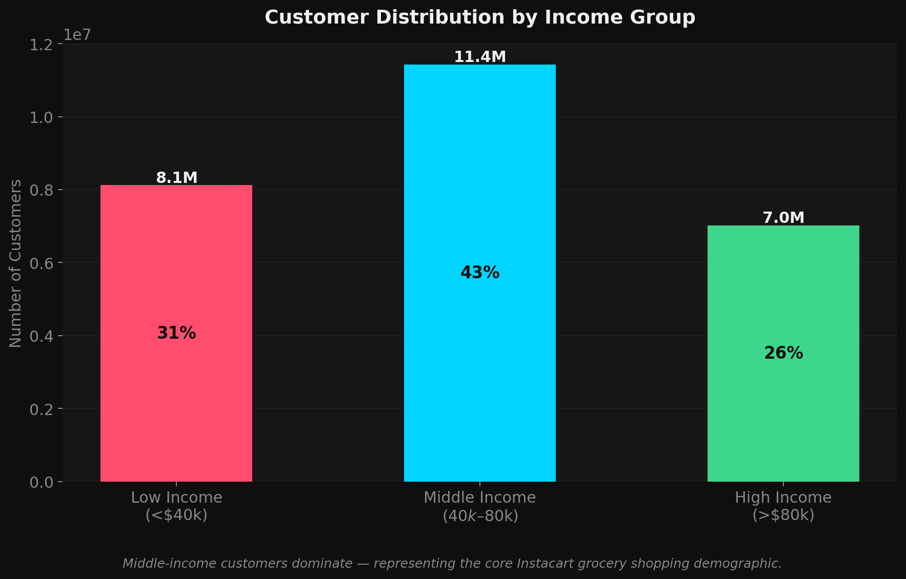
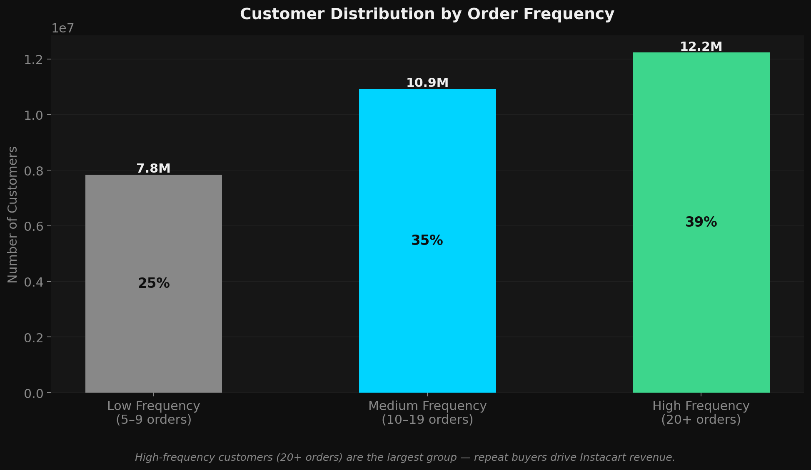
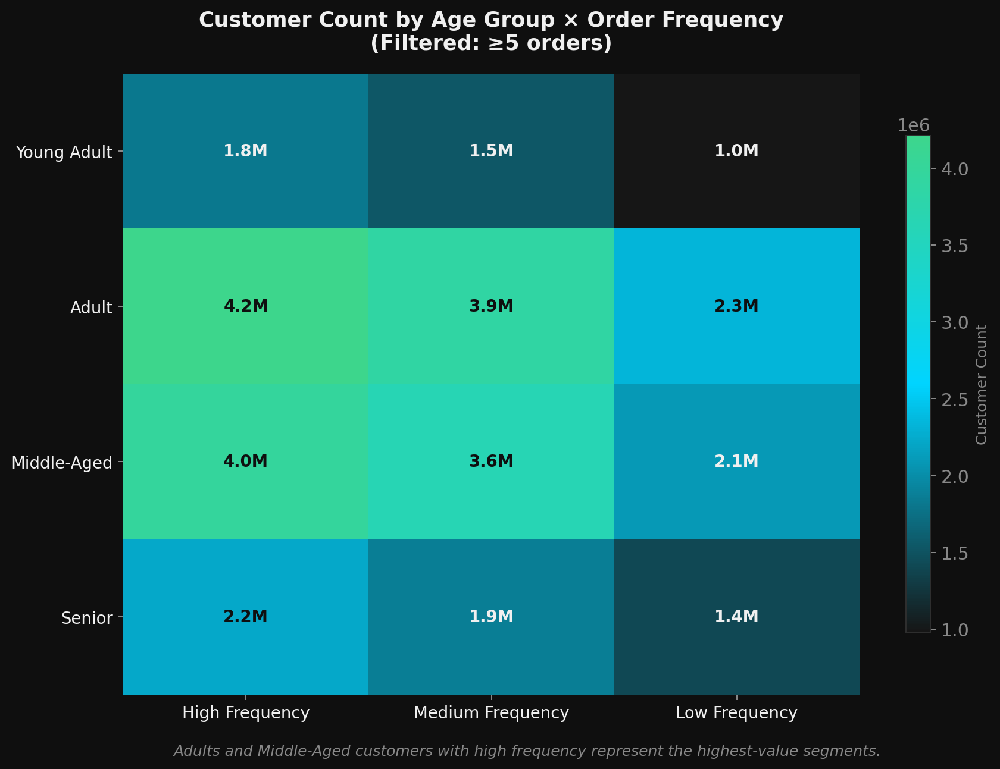

# Instacart Market Basket Analysis

**Customer segmentation and behavioral profiling** across ~32 million order rows using Python, Pandas, and Matplotlib.

[](https://python.org)
[](https://pandas.pydata.org)
[](https://matplotlib.org)
[](LICENSE)

---

## Overview

Instacart needed deeper insight into customer purchasing behavior to improve targeting and marketing. This analysis uses order-level transaction data merged with customer demographics to answer four core business questions:

1. **When are customers most active?** Which hours and days drive the most orders?
2. **What distinguishes loyal from new customers?** Segmentation by order history.
3. **How do demographics relate to spending?** Age, income, and regional patterns.
4. **Which customer profiles are highest value?** Multi-variable profiling.

**Result:** 6 validated customer segments, 9 charts, and 6 actionable business findings across ~32 million rows and ~206,000 customers.

---

## Notebooks

| Notebook | Description |
|---|---|
| `4.1 IC Importing libraries and Python data types.ipynb` | Environment setup and Python data types |
| `4.2 IC Data import and descriptive analysis.ipynb` | Import orders + products, basic profiling |
| `4.3 IC Data wrangling and subsetting.ipynb` | Rename columns, create subsets, export cleaned data |
| `4.4 IC Data consistency checks.ipynb` | Fix mixed types, handle 260K missing values |
| `4.5 IC Combining & Exporting Data.ipynb` | Merge orders + order_products + products |
| `4.5 IC Merging with Products.ipynb` | Product-level merge and validation |
| `4.6 IC Deriving New Variables.ipynb` | Create price_label, busiest_day, busiest_period_of_day |
| `4.7 IC Grouping Data.ipynb` | Loyalty flag, spending flag, order frequency flag |
| `4.8 IC Customer Data Wrangling.ipynb` | Merge 206K customer demographics |
| `4.8 IC Visualizations.ipynb` | 8 charts: orders, loyalty, prices, demographics |
| `4.9 IC Final Analysis & Profiling.ipynb` | PII removal, regional segmentation, customer profiles |

---

## Key Findings

**1. Orders peak between 9 AM and 4 PM**
The 10:00 AM hour is the single busiest period. Late-night promotions are unlikely to move volume.



**2. Regular customers drive the most order volume**
While Loyal customers (20+ orders) have higher per-order value, Regular customers (11–20 orders) generate the most total volume. A loyalty conversion strategy has the highest revenue upside.



**3. Adults (30–49) are the dominant demographic**
Marketing should optimize for family-stage purchasing: household staples, fresh produce, and meal planning.



**4. Middle-income customers are the core demographic**
The $40k–$80k income range dominates. Core catalog pricing should remain accessible while premium placement targets high-income segments.



**5. High-frequency customers are the largest single group**
Customers with 20+ orders outnumber both medium and low-frequency groups. Retention has a larger addressable base than acquisition.



**6. Adults and Middle-Aged high-frequency customers are the highest-value segments**



---

## Data Quality Issues Resolved

| Issue | Column | Resolution |
|---|---|---|
| Price outlier (max = 99,999) | `products.prices` | Flagged as data entry error — labeled High |
| 260,290 missing values | `days_since_prior_order` | Expected for first-ever orders — filled with 0 |
| Mixed data type (object) | `days_since_prior_order` | Converted with `pd.to_numeric(errors="coerce")` |
| PII in customer data | `first_name`, `last_name` | Dropped before profiling |
| Duplicate columns after merge | `total_orders (_x/_y)` | Rebuilt cleanly with groupby + merge |

---

## Customer Segmentation Variables

| Variable | Logic | Labels |
|---|---|---|
| `loyalty_flag` | mean order_number > 20 / 11–20 / ≤10 | Loyal / Regular / New Customer |
| `spending_flag` | avg item price ≥ $10 / < $10 | High spender / Low spender |
| `age_group` | < 30 / 30–49 / 50–64 / 65+ | Young adult / Adult / Middle-aged / Senior |
| `income_group` | < $40k / $40k–$80k / > $80k | Low / Middle / High income |
| `family_status` | 0 / 1–2 / 3+ dependents | No dependents / Small / Large family |
| `order_frequency` | 5–9 / 10–19 / 20+ orders | Low / Medium / High frequency |

---

## Dataset Scale

| Metric | Value |
|---|---|
| Total order rows | ~32.4 million |
| Total customers | ~206,000 |
| Orders after low-activity filter | ~31.0 million |
| Products | 49,688 |
| Departments | 21 |
| U.S. states | 50 |
| U.S. Census regions | 4 |

---

## Dependencies

```
pandas
numpy
matplotlib
seaborn
os
```

---

## Portfolio

Full case study with all charts and findings:
**[ageelalramadhan.github.io/instacart-case-study.html](https://ageelalramadhan.github.io/instacart-case-study.html)**

---

## Author

**Ageel Alramadhan** — Data Analyst · Hamburg
[LinkedIn](https://www.linkedin.com/in/ageel-alramadhan/) · [Portfolio](https://ageelalramadhan.github.io)

*CareerFoundry Data Analytics Program · DEKRA-certified · AfA-approved · 1221 UE*
